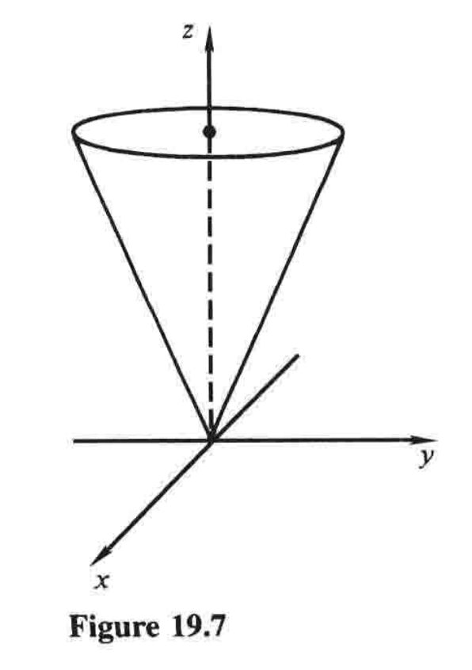

# 19.3 曲面的切平面

曲面的切平面的概念与曲线的切线的概念有关. 从几何上来说，所谓曲面在一点的切平面，是指在该点附近「最佳拟合」曲面的平面. 对我们来说，仔细思考这一点是很有必要的，因为正如我们将在19.5和19.6看到的那样，有些重要的实用结论依赖于它. 

设想一个曲面$z=f(x,y)$，如图19.6. 就像我们在19.2节中指出的，平面$y=y_0$交此曲面于曲线$C_1$，其方程为

$$z=f(x,y_0)，$$

并且平面$x=x_0$交此曲面于曲线$C_2$，其方程为

$$z=f(x_0,y)；$$

同时，在点$P_0(x_0,y_0,z_0)$处，这些曲线的切线的斜率就是偏导数

$$f_x(x_0,y_0)和f_y(x_0,y_0) \tag{1}. $$

这两条切线确定一个平面，而且如图19.6所示，如果这个曲面在$P_0$附近充分地光滑，那么这个平面就是曲面在$P_0$的切平面. 

搞清楚我们所说的切平面是什么意思，是非常重要的，那么我们给出一个定义. 设想这样一种情况：$P_0$是曲面$z=f(x,y)$上一点，令$T$是过$P_0$的一个平面，并令$P$为这个曲面上任意的其他点[^1]. 当$P$沿着曲面靠近$P_0$时，如果线段$P_0P$与平面$T$的夹角趋近于零，那么$T$就叫曲面在$P_0$处的**切平面**. 

容易看到，曲面在点$P_0$处并不一定有切平面. 一个很简单的例子是半圆锥$z=\sqrt{x^2+y^2}$，如图19.7. 显然，在原点处没有平面与该曲面相切. 此时曲线$C_1$和$C_2$在原点处没有切线，并且偏导数$(1)$在此处不存在. 然而，即便在$P_0$处曲线$C_1$和$C_2$足够光滑且有切线，曲面在$P_0$处也依然可能没有切平面，因为$P_0$附近的不光滑表现在$C_1$和$C_2$之间的区域. 在19.4节，我们探讨一个关键引理：如果偏导数$f_x(x,y)$和$f_y(x,y)$在$(x_0,y_0)$的某邻域中所有点都存在，并且在$(x_0,y_0)$本身处连续，那么这种情况就不会发生. [^2]

此时，我们设想切平面在$P_0$处存在，并开发一种方法来找出它的方程. 因为$P_0=(x_0,y_0,z_0)$位于这个切平面上，我们知道方程是这样的形式[^3]：

$$a(x-x_0)+b(y-y_0)+c(z-z_0)=0$$

其中$\mathbf{N}=a\mathbf{i}+b\mathbf{j}+c\mathbf{k}$是任意法向量. 只需找到$\mathbf{N}$，为此我们利用两向量$\mathbf{V}_1$和$\mathbf{V}_2$的叉积，它们是曲线$C_1$和$C_2$在$P_0$处的切线（如图19.6）. 为得到$\mathbf{V}_1$，我们利用这个事实，即沿着$C_1$的切线，在$x$方向的$1$单位增量导致$z$方向的$f_x(x_0,y_0)$的变化，同时$y$完全不变. 所以向量

$$\mathbf{V}_1=\mathbf{i}+ 0 \cdot \mathbf{j} + f_x(x_0,y_0) \mathbf{k}$$

就是$P_0$处$C_1$的切线. 同理，向量

$$\mathbf{V}_2=0\cdot \mathbf{i} + \mathbf{j} + f_y(x_0,y_0) \mathbf{k}$$

就是$P_0$处$C_2$的切线. 因为$\mathbf{V}_1$和$\mathbf{V}_2$处于切平面上，现在我们能够得到我们的法向量$\mathbf{N}$，计算

$$\mathbf{N}=\mathbf{V}_2 \times \mathbf{V}_1=
\begin{vmatrix}
\mathbf{i} & \mathbf{j} & \mathbf{k} \\
0 & 1 & f_y(x_0,y_0) \\
1 & 0 & f_x(x_0,y_0)
\end{vmatrix}=
f_x(x_0,y_0)\mathbf{i}+f_y(x_0,y_0)\mathbf{j}-\mathbf{k} \tag{3}$$

（这个叉积中因子的顺序的选择只是为了方便，在结果中只产生一个负号而不是两个. [^4]）把$(3)$的分量代入$(2)$，我们看到所求方程为

$$f_x(x_0,y_0)(x-x_0)+f_y(x_0,y_0)(y-y_0)-(z-z_0)=0$$

或等价的

$$z-z_0=f_x(x_0,y_0)(x-x_0)+f_y(x_0,y_0)(y-y_0)$$

**例1** 找到曲面

$$z=f(x,y)=2xy^3-5x^2$$

在点$(3,2,3)$处的切平面. 

**解** 第一步应该检查这个点是否确实在曲面上，我们假设这一步已完成. 此时我们有$f_x=2y^3-10x$和$f_y=6xy^2$，所以$f_x(3,2)=-14$且$f_y(3,2)=72$. 于是切平面的方程就是

$$z-3=-14(x-3)+72(y-2)$$

---

[^1]: 也就是$P \neq P_0$. ——译注

[^2]: 换言之，在这种条件下，曲面在$(x_0,y_0)$的切平面必存在. ——译注

[^3]: 平面的点法式. ——译注

[^4]: 若做成$\mathbf{V}_1 \times \mathbf{V}_2$，结果就是书中做法的反向向量，也是切平面的法向量，并无本质区别，只是外观不雅. ——译注