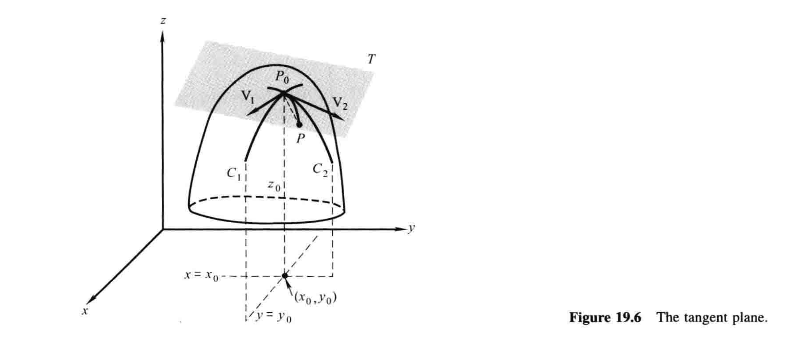

# 19.3 曲面的切平面

曲面的切平面的概念与曲线的切线的概念有关. 从几何上来说，所谓曲面在一点的切平面，是指在该点附近「最佳拟合」曲面的平面. 对我们来说，仔细思考这一点是很有必要的，因为正如我们将在19.5和19.6看到的那样，有些重要的实用结论依赖于它. 

设想一个曲面$z=f(x,y)$，如图19.6. 就像我们在19.2节中指出的，平面$y=y_0$交此曲面于曲线$C_1$，其方程为

$$z=f(x,y_0)，$$

并且平面$x=x_0$交此曲面于曲线$C_2$，其方程为

$$z=f(x_0,y)；$$

同时，在点$P_0(x_0,y_0,z_0)$处，这些曲线的切线的斜率就是偏导数

$$f_x(x_0,y_0)和f_y(x_0,y_0) \tag{1}. $$

这两条切线确定一个平面，而且如图19.6所示，如果这个曲面在$P_0$附近充分地光滑，那么这个平面就是曲面在$P_0$的切平面。

搞清楚我们所说的切平面是什么意思，是非常重要的，那么我们给出一个定义。设想这样一种情况：$P_0$是曲面$z=f(x,y)$上一点，令$T$是过$P_0$的一个平面，并令$P$为这个曲面上任意的其他点[^1]。当$P$沿着曲面靠近$P_0$时，如果线段$P_0P$与平面$T$的夹角趋近于零，那么$T$就叫曲面在$P_0$处的**切平面**。

[^1]: 也就是$P \neq P_0$。——译注