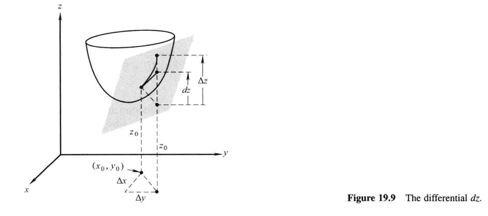

# 19.4 增量和微分 基本引理

微积分的大部分内容可以通过几何直觉再加上一点点常识来理解，不需要拘泥于某个主题的基础理论. 不过在一些地方，这种理论还是逃不开的，因为如果没有了它，就无法弄清这个主题首要问题到底是什么. 这对于无穷级数和收敛理论是适用的，对于接下来两节的话题——方向导数和链式法则，也是适用的. 如果对我们接下来讨论的基本问题缺乏一定程度的重视，那么理解就无从谈起. 

为了引入这些问题，我们从考虑一个在点$x_0$处可导的单变量函数$y=f(x)$开始. 设有增量$\Delta x$使得点$x_0$变化至点$x_0+\Delta x$，我们感兴趣的是相应的$y$的增量

$$\Delta y=f(x_0+\Delta x)-f(x_0)$$

导数$f'(x_0)$的定义是

$$f'(x_0)=\lim_{\Delta x \to 0}\frac{\Delta y}{\Delta x} \tag{1}$$

还可以写成等价形式

$$\frac{\Delta y}{\Delta x}=f'(x_0)+\epsilon$$

其中$\Delta x \to 0$时$\epsilon \to 0$. 此时，除了假定导数$(1)$存在以外，无需任何其他假设，就可以写出$\Delta y$为如下形式[^1]：

$$\Delta y=f'(x_0)\Delta x+\epsilon \Delta x \tag{2}$$

其中$\Delta x \to 0$时$\epsilon \to 0$. 

接下来我们解释，对于两个及以上变量的函数，情况则大相径庭. 

考虑函数$z=f(x,y)$，设$(x_0,y_0)$是使得偏导数$f_x(x_0,y_0)$和$f_y(x_0,y_0)$都存在的一点. 如图19.9，由点$(x_0,y_0)$移动到点$(x_0+\Delta x,y_0+\Delta y)$时$z$的增量就是

$$\Delta z=f(x_0+\Delta x,y_0+\Delta y)-f(x_0,y_0)$$

为了发展我们在19.5和19.6节中将会用到的工具，像$(2)$那样表示$\Delta z$是很有必要的：

$$\Delta z=f_x(x_0,y_0)\Delta x+f_y(x_0,y_0)\Delta y+\epsilon_1 \Delta x+\epsilon_2 \Delta y \tag{3}$$

其中当$\Delta x$和$\Delta y \to 0$时，$\epsilon_1$和$\epsilon_2 \to 0$. 遗憾的是，与单变量的情形形成鲜明对比，仅凭偏导数$f_x$和$f_y$在$(x_0,y_0)$处存在，并不足以保证$(3)$的正确性. 这个结论[^2]的充分条件是：

!!! info "基本引理"
    设函数$z=f(x,y)$及其偏导数$f_x$和$f_y$在点$(x_0,y_0)$处及其某邻域内有定义，进一步设$f_x$和$f_y$在$(x_0,y_0)$处连续，则增量$\Delta z$可以用$(3)$的形式表示，其中当$\Delta x$和$\Delta y \to 0$时，$\epsilon_1$和$\epsilon_2 \to 0$. 

这个陈述之所以称为**引理**，通常是因为它的重要性并不在于自身，而在于别处的功用. 附录A.19中给出了一个证明. 

我们不倾向于在此过多逗留，只简短讲几个注记. 

**注记1** 在单变量函数的情形中，$(1)$和$(2)$是等价的，若任意一个满足，习惯上就把$\Delta x$写成$dx$，$\Delta y$写成$dy$，于是$dy$就是沿切线$y$的变化. 而对于函数$z=f(x,y)$，若$f_x(x_0,y_0)$和$f_y(x_0,y_0)$都存在，并且引理也成立，那么才能称函数是**可微的**——可见仅偏导数存在仍是不够的[^3]. 这种情况下——并且仅在这种情况下！——我们把$\Delta x$和$\Delta y$写成$dx$和$dy$，并定义**微分**$dz$为[^4]

$$dz=f_x(x_0,y_0)dx+f_y(x_0,y_0)dy$$

此种情形下，可以证明曲面$z=f(x,y)$在点$(x_0,y_0,z_0)$处有一个切平面，而**$dz$就是$z$沿着该平面的变化**，如图19.9所示. 微分$dz$也常写成以下等价形式：

$$dz=\frac{\partial z}{\partial x}dx+\frac{\partial z}{\partial y}dy$$

或

$$df=\frac{\partial f}{\partial x}dx+\frac{\partial f}{\partial y}dy$$

**注记2** 函数$z=f(x,y)$在某一点可微，自然就在这一点连续. 这从$(3)$立即可得，因为$\Delta x$和$\Delta y \to 0$时，$\Delta z \to 0$. 在单变量的情形下，我们知道函数如果在一点可导，那它在这一点必然连续. 然而，这对于多变量函数则未必成立：仅仅是偏导数$f_x$和$f_y$在一点的存在，并不意味着$f(x,y)$在该点连续. 这已经通过19.1节中那个怪异的函数为例展示过了，其中$f_x(0,0)=f_y(0,0)=0$，但函数在$(0,0)$并不连续. 

可微函数及其微分的概念，以及基本引理，可以通过很明显的方式拓展到任意的变量数有限的函数. 只不过可能会写得比较长，但思想并不新鲜，所以我们还是不要给读者增加这种负担了. 

[^1]: 对上述「等价形式」两边同乘以$\Delta x$即得. ——译注

[^2]: 即$(3)$. ——译注

[^3]: ... so that more is required than merely the existence of the partial derivatives ... ——译注

[^4]: 有时$dz$也称为**全微分**（total differential）[^5]. 

[^5]: 「全微分」这个名字在国内体系中非常重要，如同济版《高等数学》直接将「全微分」作为节标题. ——译注