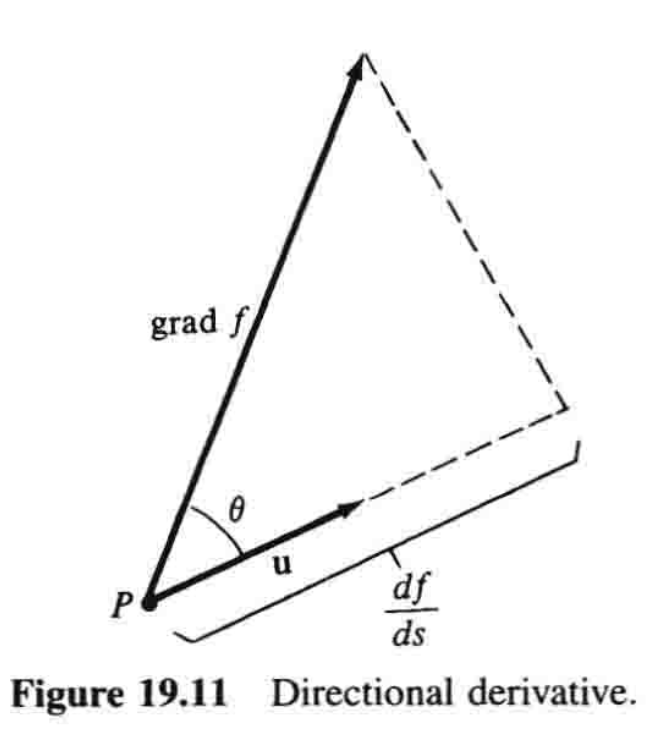
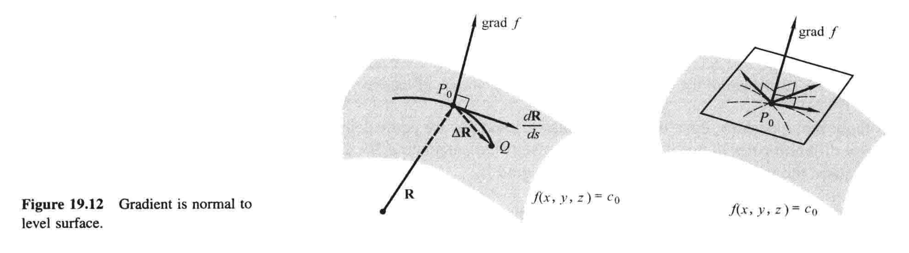

# 19.5 方向导数和梯度

$\DeclareMathOperator{\grad}{grad}$

设$f(x,y,z)$为定义在三维空间中某区域内的函数（三个变量！），并设$P$为该区域内一点. 当我们让$P$沿着某个特定方向移动时，$f$的变化率是多少？当沿着$x$、$y$和$z$轴正方向时，我们知道$f$的变化率是偏导数$\partial f/\partial x$、$\partial f/\partial y$和$\partial f/\partial z$. 但是如果我们让$P$沿着非坐标轴方向移动，又该如何计算$f$的变化率？在对这个问题的分析中，我们将会遇到一个极为重要的概念——函数的梯度. 

设我们研究的点$P$有坐标$x$、$y$和$z$，所以$P=(x,y,z)$；设$\mathbf{R}=x\mathbf{i}+y\mathbf{j}+z\mathbf{k}$是$P$的位置向量，并用单位向量$\mathbf{u}$给出一个特定的方向，如图19.10[^1]. 如果我们把$P$沿着这个方向移到$Q=(x+\Delta x,y+\Delta y,z+\Delta z)$，那么函数$f$就有变化量$\Delta f$. 如果我们现在用$P$和$Q$之间的距离$\Delta s=|\Delta \mathbf{R}|$来除这个变化量$\Delta f$，那么商$\Delta f/\Delta s$就是当我们把$P$移到$Q$时$f$（关于距离）的平均变化率. 例如，如果$f$在$P$的值是这一点的温度，那么$\Delta f/\Delta s$就是沿着线段$PQ$温度的平均变化率. 当$Q$趋近于$P$时的极限，即所谓的

$$\frac{df}{ds}=\lim_{\Delta s\to 0}\frac{\Delta f}{\Delta s}$$

就称为**$f$在点$P$处沿方向$\mathbf{u}$的导数**，简称$f$的**方向导数**. 以温度函数为例，$df/ds$表示当我们将$P$沿$\mathbf{u}$确定的方向移动时，温度关于距离的瞬时变化率——说直白点就是它热得有多快. 

一切都非常好，但是在给定情形下，我们怎么才能实际计算出$df/ds$呢？为了探索其做法，我们假设$f(x,y,z)$有关于$x$、$y$和$z$的连续偏导数. 为了避免重复这个冗长单调的假设，如无特别说明，不妨把它作为所讨论的每个函数的基本设定. 此时，基本引理就使得我们可以用这种形式写出$\Delta f$：

$$\Delta f=\frac{\partial f}{\partial x}\Delta x+\frac{\partial f}{\partial y}\Delta y+\frac{\partial f}{\partial z}\Delta z+\epsilon_1\Delta x+\epsilon_2 \Delta y+\epsilon_3\Delta z \tag{1}$$

当$\Delta x$、$\Delta y$和$\Delta z\to 0$也即$\Delta s \to 0$时，$\epsilon_1, \epsilon_2, \epsilon_3 \to 0$. 用$\Delta s$除$(1)$就有

$$\frac{\Delta f}{\Delta s}=\frac{\partial f}{\partial x}\frac{\Delta x}{\Delta s}+\frac{\partial f}{\partial y}\frac{\Delta y}{\Delta s}+\frac{\partial f}{\partial z}\frac{\Delta z}{\Delta s}+\epsilon_1\frac{\Delta x}{\Delta s}+\epsilon_2\frac{\Delta y}{\Delta s}+\epsilon_3\frac{\Delta z}{\Delta s} \tag{2}$$

随后取$\Delta s\to 0$时的极限，我们看到末尾三项趋于零，于是我们就得到方程

$$\frac{df}{ds}=\frac{\partial f}{\partial x}\frac{dx}{ds}+\frac{\partial f}{\partial y}\frac{dy}{ds}+\frac{\partial f}{\partial z}\frac{dz}{ds} \tag{3}$$

这个方程应该理解为一种特殊的链式法则，当我们沿着过$P$且与$\mathbf{u}$平行的直线移动时，$f$是$x$、$y$和$z$的函数，而$x$、$y$和$z$又分别是距离$s$的函数，故$(3)$就展示了如何关于$s$对$f$微分. [^2]

我们注意到，$(3)$右端每个乘积中的第一个因子，只依赖于函数$f$以及计算$f$的偏导数时所取点$P$的坐标，而每个乘积中的第二个因子是关于$f$独立的，且仅依赖于计算$df/ds$时的方向. 这些事实表明，$(3)$的右边应该被看作——并且被写成——两个向量的点积，如下：

$$
\begin{align}
\frac{df}{ds} &= \left(\frac{\partial f}{\partial x}\mathbf{i}+\frac{\partial f}{\partial y}\mathbf{j}+\frac{\partial f}{\partial z}\mathbf{k}\right) \cdot \left(\frac{dx}{ds}\mathbf{i}+\frac{dy}{ds}\mathbf{j}+\frac{dz}{ds}\mathbf{k}\right) \\
&= \left(\frac{\partial f}{\partial x}\mathbf{i}+\frac{\partial f}{\partial y}\mathbf{j}+\frac{\partial f}{\partial z}\mathbf{k}\right) \cdot \frac{d\mathbf{R}}{ds}
\end{align} \tag{4}
$$

这里第一个因子是一个向量，称为$f$的**梯度**，符号记作$\grad f$[^3]. 因此根据定义

$$\grad f=\frac{\partial f}{\partial x}\mathbf{i}+\frac{\partial f}{\partial y}\mathbf{j}+\frac{\partial f}{\partial z}\mathbf{k} \tag{5}$$

有了这个记号，$(4)$就可以写成

$$\frac{df}{ds}=(\grad f) \cdot \frac{d\mathbf{R}}{ds} \tag{6}$$

但是我们知道，$d\mathbf{R}/ds$是一个单位向量，又因为它和$\mathbf{u}$方向相同，所以它和$\mathbf{u}$相等. 故式$(6)$就等价于

$$\frac{df}{ds}=(\grad f)\cdot \mathbf{u} \tag{7}$$

这告诉我们怎样计算$df/ds$，因为$(5)$对于给定的函数$f$大概率是很好算的，随后求出给定点$P$处的值，接着两个位置向量的点积$(7)$就很容易求. 

对于给定函数$f$和给定点$P$，$\grad f$是一个可以平移的已知向量[^4]，不妨将其尾部移到$P$. 我们也把$\mathbf{u}$的尾部移到$P$，如图19.11所示. 为理解$\grad f$的重要性，我们利用点积的定义，以及$\mathbf{u}$是单位向量的事实，将$(7)$写成如下形式：

$$\frac{df}{ds}=|\grad f|\cos \theta \tag{8}$$

其中$\theta$是$\grad f$和$\mathbf{u}$之间的夹角. 由于$\mathbf{u}$的方向可以根据我们的需要来选择，从$(8)$立即可得梯度的第一个基本性质：

!!! info "性质1"
    任意给定方向的方向导数$df/ds$就是$\grad f$在那个方向上的标量投影（如图19.11）. 

从这个意义上说，单个向量$\grad f$本身包含了函数$f$在点$P$处沿所有可能方向的方向导数信息. [^5]

接着，如果选定的$\mathbf{u}$指向与$\grad f$相同的方向，那么$\theta = 0$，$\cos \theta = 1$，此时由$(8)$可知$df/ds$取得最大值，即在这个方向上$f$增长最快. 而且，这个最大值等于$|\grad f|$. 以上讨论给出了下面两个梯度的性质：

!!! info "性质2"
    向量$\grad f$指向$f$增长最快的方向. 

!!! info "性质3"
    向量$\grad f$的长度就是$f$的最快增速. 

上述性质表明，虽然式$(7)$和式$(8)$是等价的，但是它们在我们思考时扮演完全不同的角色，因为我们用$(7)$来计算$df/ds$，用$(8)$来理解向量$\grad f$的直观意义. 

**例1** 若$f(x,y,z)=x^2-y+z^2$，求点$(1,2,1)$处在向量$4\mathbf{i}-2\mathbf{j}+4\mathbf{k}$方向的方向导数$df/ds$. 

**解** 在点$(1,2,1)$处，我们有$\grad f=2x\mathbf{i}-\mathbf{j}+2z\mathbf{k}=2\mathbf{i}-\mathbf{j}+2\mathbf{k}$. 通过将给定的向量除以它的长度，我们得到一个所需方向的单位向量$\mathbf{u}$：

$$\mathbf{u}=\frac{4\mathbf{i}-2\mathbf{j}+4\mathbf{k}}{\sqrt{16+4+16}}=\frac{2}{3}\mathbf{i}-\frac{1}{3}\mathbf{j}+\frac{2}{3}\mathbf{k}$$

现由式$(7)$可得：

$$
\begin{align}
\frac{df}{ds} &= (\grad f)\cdot \mathbf{u} \\
&= (2\mathbf{i}-\mathbf{j}+2\mathbf{k}) \cdot (\frac{2}{3}\mathbf{i}-\frac{1}{3}\mathbf{j}+\frac{2}{3}\mathbf{k}) = 3
\end{align}
$$

因此，当我们从$(1,2,1)$向指定方向移动时，函数$f$在每个单位距离上以$3$个单位的速度增长. 

---

**例2** 空气中每一点的温度由函数$f(x,y,z)=x^2-y+z^2$给出. 一只位于$(1,2,1)$的蚊子想尽快到凉爽的地方去. 它应该往何方向飞？

**解** 例1中我们已经知道，点$(1,2,1)$处$\grad f=2\mathbf{i}-\mathbf{j}+2\mathbf{k}$. 因为$\grad f$的方向是温度增长最快的方向，所以蚊子应该往它的反方向飞，即$-\grad f=-2\mathbf{i}+\mathbf{j}-2\mathbf{k}$. 

---

第四个基本性质在几何上很有用. 为解释它，我们记所讨论的点为$P_0=(x_0,y_0,z_0)$，以此强调在讨论中它是个定点，同时记$c_0$为我们的函数$f$在$P_0$处的值. 使得$f(x,y,z)$的值为$c_0$的所有点的集合，一般而言就形成了一个过$P_0$的等值面，其方程为$f(x,y,z)=c_0$. 我们想说明的是，在$P_0$处，向量$\grad f$垂直于这个等值面，如图19.12所示. 为此，我们考虑曲面上过$P_0$的一条曲线. 如果我们移动到曲线上邻近的一点$Q$，并沿着曲线计量$s$，那么$\Delta f=0$，因为$f$在这个曲面上每个点的值都相同；进而在$P_0$处，在曲线的切线方向上，$df/ds=0$. 式$(6)$依然成立，并表明

$$(\grad f)\cdot \frac{d\mathbf{R}}{ds}=0 \tag{9}$$

其中$d\mathbf{R}/ds$就是在$P_0$处曲线的单位切向量. $(9)$中点积为零告诉我们，$\grad f$是垂直于这个切向量的. 而且，同样的推理对曲面上任何过$P_0$的曲线都成立，所以$\grad f$与这些曲线的切向量都垂直. 又因为这些切向量决定了$P_0$处的切平面，而与曲面垂直也就是与这个切平面垂直，遂有：

!!! info "性质4"
    函数$f(x,y,z)$在点$P_0$处的梯度垂直于$f$的过$P_0$的等值面. 

接着刚才的讨论，我们指出，任何曲面的方程都可以写成$f(x,y,z)=c_0$的形式，从而可以被看作函数$f(x,y,z)$的一个等值面. [^6]若$P_0=(x_0,y_0,z_0)$是这个曲面上的一点，性质4就告诉我们，向量

$$\mathbf{N}=\grad f=\left(\frac{\partial f}{\partial x}\right)_{P_0}\mathbf{i}+\left(\frac{\partial f}{\partial y}\right)_{P_0}\mathbf{j}+\left(\frac{\partial f}{\partial z}\right)_{P_0}\mathbf{k}$$

垂直于$P_0$处的切平面；所以若$\mathbf{N} \neq 0$，这个切平面的方程就是

$$\left(\frac{\partial f}{\partial x}\right)_{P_0}(x-x_0)+\left(\frac{\partial f}{\partial y}\right)_{P_0}(y-y_0)+\left(\frac{\partial f}{\partial z}\right)_{P_0}(z-z_0)=0 \tag{10}$$

注意到，[19.3节](3.md)方程$(4)$是这个方程的一种特例，因为如果曲面以$z=g(x,y)$的形式给出，那么这就可以写成$g(x,y)-z=0$，从而曲面就是函数$f(x,y,z)=g(x,y)-z$的一个等值面，这就使得$(10)$中的系数分别等于$g_x(x_0,y_0)$、$g_y(x_0,y_0)$、$-1$. 

**例3** 求曲面$xy^2z^3=12$在点$(3,-2,1)$处的切平面方程. 

**解** 这个曲面是函数$f(x,y,z)=xy^2z^3$的一个等值面. 向量$\grad f$在点$(3,-2,1)$处垂直于该点的曲面. 这个向量就是

$$
\begin{align}
\grad f &= y^2z^3\mathbf{i}+2xyz^3\mathbf{j}+3xy^2z^2\mathbf{k} \\
&= 4\mathbf{i}-12\mathbf{j}+36\mathbf{k}=4(\mathbf{i}-3\mathbf{j}+9\mathbf{k})
\end{align}
$$

因此切平面的方程为

$$(x-3)-3(y+2)+9(z-1)=0$$

或

$$x-3y+9z=18$$

---

**注记1** 方向导数主要应用于几何学和三维物理问题. 不过，这些概念在二维中也可以定义，而且具备相似（但更简约）的性质. 因此，曲线$f(x,y)=c_0$可以被看作函数$z=f(x,y)$的一条等值线；而且如果这个函数的梯度被定义为

$$\grad f=\frac{\partial f}{\partial x}\mathbf{i}+\frac{\partial f}{\partial y}\mathbf{j}$$

那么曲线上一点$P_0$处的梯度是一个垂直于曲线的向量. [^7]

**注记2** 函数$f(x,y,z)$的梯度可以被写成这种「算子形式」[^8]：

$$\grad f=\left(\frac{\partial}{\partial x}\mathbf{i}+\frac{\partial}{\partial y}\mathbf{j}+\frac{\partial}{\partial z}\mathbf{k}\right)f$$

函数$f$前面的**del算子**一般记作符号$\nabla$（一个反转的delta，读作「del」）[^9]，也即

$$\nabla=\frac{\partial}{\partial x}\mathbf{i}+\frac{\partial}{\partial y}\mathbf{j}+\frac{\partial}{\partial z}\mathbf{k}$$

这个del算子类似于我们熟悉的微分算子$d/dx$，但也更复杂. 当del作用于函数$f$，它产生一个向量，即向量$\grad f$. 用这种记法，式$(5)$、$(6)$和$(7)$便成为

$$\grad f=\nabla f, \quad \frac{df}{ds}=\nabla f\cdot \frac{d\mathbf{R}}{ds}, \quad \frac{df}{ds}=\nabla f\cdot \mathbf{u}$$

我们在第21章将会充分利用算子$\nabla$. 

[^1]: 一定要注意，这是**三变量函数**的**定义域**图，$z$轴也代表一个自变量，此图不表现函数值. ——译注

[^2]: 这句话的意思是，当移动$P$的时候，由于方向是已定的，所以$P$的坐标$x$、$y$和$z$就可以通过移动的距离$s$得到，也就是$x=x(s)$、$y=y(s)$和$z=z(s)$，所以$f(x,y,z)$其实就是$f(x(s),y(s),z(s))$. 因此，$df/ds$就成了一个复合函数微分的问题. ——译注

[^3]: 同济《高等数学》记作粗体的$\operatorname{\mathbf{grad}} f$，体现出它是个向量. ——译注

[^4]: ... a fixed vector which can be placed ... ——译注

[^5]: 这句话的意思是，有了$\grad f$就**足以算出**$f$在$P$点处所有方向的方向导数. ——译注

[^6]: 可以这样理解：曲面的方程就是含$x$、$y$、$z$的方程，但是意义有两种. 第一种，等价化成$z=f(x,y)$，这个曲面是**二元**函数$z=f(x,y)$的图像；第二种，等价化成$f(x,y,z)=c_0$，这个曲面是**三元**函数$m=f(x,y,z)$的一个等值面，函数值为$m=c_0$. 因为某些情况下这几种形式间可以互化，所以我们的看法也可以互化. 只是$z$轴的意义是不同的，前者$z$轴代表函数值，后者$z$轴代表一个自变量. 举个例子：$x^2+y+z=3$，化成第一种形式就是$z=3-x^2-y$，那么曲面就是函数$z=f(x,y)=3-x^2-y$的图像；化成第二种形式就是$m=f(x,y,z)=x^2+y+z=3$，那么曲面就是函数$f(x,y,z)=x^2+y+z$的一个等值面，在这个面上的点，函数值皆为$3$. ——译注

[^7]: 与曲面同理，所谓垂直于曲线，实际上就是垂直于曲线在这一点的切线. ——译注

[^8]: "operational form"——译注

[^9]: $\nabla$又称为**向量微分算子**或**Nabla算子**. ——译注