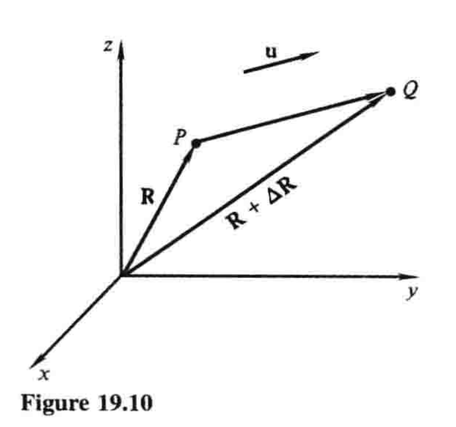

# 19.5 方向导数和梯度

设$f(x,y,z)$为定义在三维空间中某区域内的函数（三个变量！），并设$P$为该区域内一点. 当我们让$P$沿着某个特定方向移动时，$f$的变化率多少？当沿着$x$、$y$和$z$轴正方向时，我们知道$f$的变化率是偏导数$\partial f/\partial x$、$\partial f/\partial y$和$\partial f/\partial z$. 但是如果我们让$P$沿着非坐标轴方向移动，又该如何计算$f$的变化率？在对这个问题的分析中，我们将会遇到一个极为重要的概念——函数的梯度. 

设我们研究的点$P$有坐标$x$、$y$和$z$，所以$P=(x,y,z)$；设$\mathbf{R}=x\mathbf{i}+y\mathbf{j}+z\mathbf{k}$是$P$的位置向量，并用单位向量$\mathbf{u}$给出一个特定的方向，如图19.10[^1]. 如果我们把$P$沿着这个方向移到$Q=(x+\Delta x,y+\Delta y,z+\Delta z)$，那么函数$f$就有变化量$\Delta f$. 如果我们现在用$P$和$Q$之间的距离$\Delta s=|\Delta \mathbf{R}|$来除这个变化量$\Delta f$，那么商$\Delta f/\Delta s$就是当我们把$P$移到$Q$时$f$（关于距离）的平均变化率. 例如，如果$f$在$P$的值是这一点的温度，那么$\Delta f/\Delta s$就是沿着线段$PQ$温度的平均变化率. 当$Q$趋近于$P$时的极限，即所谓的

$$\frac{df}{ds}=\lim_{\Delta s\to 0}\frac{\Delta f}{\Delta s}$$

就称为**$f$在点$P$处沿方向$\mathbf{u}$的导数**，简称$f$的**方向导数**. 以温度函数为例，$df/ds$表示当我们将$P$沿$\mathbf{u}$确定的方向移动时，温度关于距离的瞬时变化率——说直白点就是它热得有多快. 

[^1]: 一定要注意，这是**三变量函数**的**定义域**图，$z$轴也代表一个自变量，此图不表现函数值. ——译注