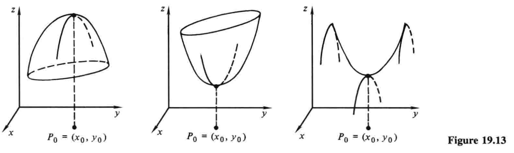

# 19.7 最大值与最小值问题

$\newcommand{\p}{\partial}$

在单变量函数的情形中，导数的一个主要应用就是研究最大值和最小值. 在第4章，我们建立了基于一阶导数和二阶导数的一些判别法，我们利用这些判别法来作函数图像，并解决大量几何和物理问题. 两个或多个变量的最大值和最小值问题则复杂得多. 这里我们仅初步涉猎这些问题，包括两个变量版本的二阶导数判别法（4.2节注记3）. 

设函数$z=f(x,y)$在定义域的一内点$P_0=(x_0,y_0)$处有最大值. 这意味着$f(x,y)$有定义，并且在$P_0$的某个邻域内有$f(x,y) \le f(x_0,y_0)$，如图19.13左所示.[^1] 如果我们在$y_0$处保持$y$不变，那么$z=f(x,y_0)$就只是$x$的函数，又由于它在$x=x_0$处有最大值，如第4章所述，它在此处的导数必为零. 也就是该点处$\p z/\p x=0$. 同理，该点处$\p z/\p y=0$. 因此方程

$$\frac{\p z}{\p x}=0, \quad \frac{\p z}{\p y}=0 \tag{1}$$

就是在最大值点$(x_0,y_0)$满足的关于两个未知数的方程. 很多时候，我们可以联立解出这两个方程，从而求出点$(x_0,y_0)$，再求出函数实际的最大值. 

同样的考虑也完全适用于最小值，如图中间所示. 然而，当我们试图通过解方程$(1)$来确定函数的最大、最小值时，必须注意到，这两个方程在一个鞍形点也成立，如图右所示，此处函数在一个方向上有最大值，在另外某个方向上有最小值. 方程$(1)$只能说明切平面是水平的，至于这个事实意味着什么，则需要我们来判断. 

类似于我们早前在第4章中基于单变量函数的定义，我们称使得两偏导数都为$0$的点$(x_0,y_0)$为$f(x,y)$的一个**临界点[^2]**. 

**例1** 一个无顶的长方体盒子有固定体积$4 \,\mathrm{ft}^3$，找出能够使得它具有最小表面积的三边长. 

**解** 若$x$和$y$是底面的边长，$z$是高，那么面积就是

$$A=xy+2xz+2yz$$

因为$xyz=4$，我们有$z=4/xy$，化简后的面积就可以写成两个变量$x$和$y$的函数

$$A=xy+\frac{8}{y}+\frac{8}{x} \tag{2}$$

我们寻找这个函数的一个临界点，即这样一个点，使得

$$\frac{\p A}{\p x}=y-\frac{8}{x^2}=0, \quad \frac{\p A}{\p y}=x-\frac{8}{y^2}=0$$

联立解这两个方程，先写成

$$x^2y=8, \quad xy^2=8$$

两式相除，得$x/y=1$，所以$y=x$，两个式子都变成$x^3=8$. 因此$x=y=2$，据此又可得$z=1$，所以盒子面积的最小值就等于正方形底面乘以底边边长的一半. 

---

这个例子中，几何上很明显，临界点$(2,2)$实际上就是最小值点，而不是最大值点或者鞍形点. 不过，在更复杂的情形中，我们可能找到一个单凭常识完全说不清本质的临界点. 判明临界点的一个有用的工具，就是**二阶导数判别法**：

!!! note "二阶导数判别法"
    若$f(x,y)$在点$(x_0,y_0)$的邻域中有连续二阶偏导数，并且定义一个数$D$为

    $$D=f_{xx}(x_0,y_0)f_{yy}(x_0,y_0)-[f_{xy}(x_0,y_0)]^2 \tag{3}$$

    那么$(x_0,y_0)$就是

    1. 一个最大值点，当$D \gt 0$且$f_{xx}(x_0,y_0) \lt 0$；
    2. 一个最小值点，当$D \gt 0$且$f_{xx}(x_0,y_0) \gt 0$；
    3. 一个鞍形点，当$D \lt 0$. 

    进一步而言，若$D=0$，那么无法得出任何结论，1—3中的任何情况都可能发生. 

这个定理的完整证明需要我们无法使用的数学工具. 我们建议感兴趣的学生额外读些进阶书籍. [^3]

**例1（续）** 作为使用二阶导数判别法的一个示范，我们将其用于验证在例1中求得的临界点$(2,2)$是函数$(2)$的一个最小值点. 此处我们有

$$A_{xx}=\frac{16}{x^3}, \quad A_{yy}=\frac{16}{y^3}, \quad A_{xy}=1$$

因此判别式$(3)$的值为$D=2\cdot 2-1^2=3 \gt 0$. 又因$A_{xx}$在点$(2,2)$处也是正的，判别法告诉我们，该临界点确实是最小值点，正如预期. 

---

**例2** 求函数

$$z=3x^2+2xy+y^2+10x+2y+1$$

的临界点，并运用二阶导数判别法说明其性质. 

**解** 我们有

$$\frac{\p z}{\p x}=6x+2y+10=0, \quad  \frac{\p z}{\p y}=2x+2y+2=0$$

所以我们要解的方程组是

$$
\begin{align}
3x+y &= -5 \\
x+y &= -1
\end{align}
$$

简便起见，观察得$x=-2$，$y=1$，所以只有一个临界点$(-2,1)$. 在这一点，我们有

$$D=z_{xx}z_{yy}-z_{xy}^2=6\cdot 2-2^2=8 \gt 0$$

又因为$z_{xx}=6 \gt 0$，故临界点是最小值点. 

---

成功求出函数$z=f(x,y)$的最大值和最小值，显然有赖于解联立方程$f_x=0$和$f_y=0$的能力. 在例1和例2中，这些方程易于解出. 然而，学生也很容易想到，在很多复杂的情形中，常规的解联立方程的方法收效甚微. 我们只能给出的一般性建议就是，尝试从其中一个方程接触一个未知数，将这个解代入第二个方程中，然后尝试解出结果. 此外，多猜想、多出奇制胜——给建议简单，遵循建议难啊！

[^1]: 此处讨论中，我们只考虑所谓的**相对**（或**局部**）最大值，即只考虑$P_0$附近的点；简单起见，我们省略形容词. 

[^2]: critical point——译注

[^3]: 例如，见R. C. Buck的*Advanced Calculus*（McGraw-Hill，1978），157—159页. 