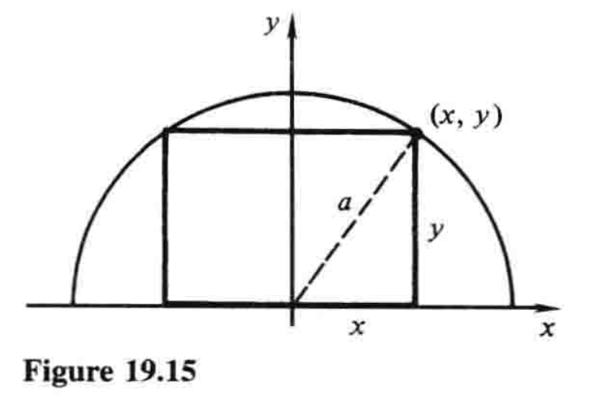
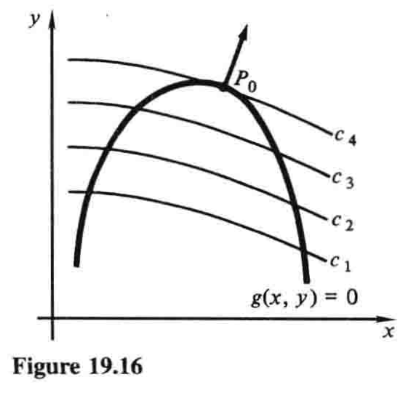

# 19.8 条件极值 拉格朗日乘数法

$$
\newcommand{\p}{\partial}
\newcommand{\v}{\mathbf}
\DeclareMathOperator{\grad}{grad}
$$

这一节中，我们通过对梯度的几何意义的直观认识，来阐明拉格朗日乘数法. 这一方法用于最大化和最小化受一个或多个约束的多变量函数. 在经济学、微分几何及高级理论力学中，它都是一个重要工具. 

我们从最简单的例子开始，即两个变量和一个约束. 

在19.7节中，我们学习了如何计算关于两个自变量$x$和$y$的函数$z=f(x,y)$的最大值和最小值. 然而很多情况下，$x$和$y$并不是自变量，而是通过等式

$$g(x,y)=0 \tag{1}$$

的形式被连接为一个**边界条件**或**约束**. 

在第4章中，我们已经很熟悉这类情况. 下面是一个简单的示例. 

**例1** 求能内接于半径为$a$的半圆中的最大面积矩形的尺寸. 

**解** 从图19.15可知，问题就是最大化函数

$$A=2xy \tag{2}$$

其满足约束

$$x^2+y^2=a^2 \tag{3}$$

在4.3节例3中，我们利用约束$(3)$，将$A$表示成只关于一个变量的函数，从而解决了问题：

$$y=\sqrt{a^2-x^2}, \quad A=2x\sqrt{a^2-x^2}$$

这时我们计算$dA/dx$，令其等于零，解出这个方程，等等. 这个例子将在一些注记和解释后继续. 

---

刚才我们介绍的过程对于这个问题已然足够，但是若作为一般性的方法，它还有两大不足. 首先，这种特定情形下，从方程$(3)$中很容易解出$y$，但是在其他问题中，约束$(1)$可能非常复杂，于是就很难解或不可能解. 另一个不足是，虽然$x$和$y$事实上在问题中扮演同等的角色，但解题时的处理却大相径庭：我们选出一个变量$x$作为自变量，另一个变量$y$作为因变量. 通常更方便也更优雅的做法是，用对称的方法处理这种问题，不要对某个变量施加相对于其他变量的偏好.[^1]

现在我们回到一般性问题中，即最大化满足约束$g(x,y)=0$的函数$f(x,y)$. 为理解问题，我们作出$g(x,y)=0$的图像（图19.16），还有函数$f(x,y)$的一些等高线$f(x,y)=c$，并指出$c$增大的方向. 例如在图中，我们设$c_1 \lt c_2\lt c_3 \lt c_4$. 为了求$f(x,y)$沿着曲线$g(x,y)=0$的最大值，我们求最大的$c$，使得$f(x,y)=c$和$g(x,y)=0$相交. 在这个交点（图中$P_0$），两曲线有相同的切线，因此它们也有相同的垂线. 又因向量

$$\grad f=\frac{\p f}{\p x}\v{i}+\frac{\p f}{\p y}\v{j}$$

和

$$\grad g=\frac{\p g}{\p x}\v{i}+\frac{\p g}{\p y}\v{j}$$

垂直于两直线，故在$P_0$处互相平行. 因此在$P_0$处，其中一个向量是另一个向量的标量倍数，即

$$\grad f=\lambda \grad g \tag{4}$$

对某个数$\lambda$成立. （这个陈述假设$P_0$处$\grad g \neq \v{0}$，因此曲线$g(x,y)=0$实际上在该点有切线. ）

向量方程$(4)$连同$g(x,y)=0$，引出三个标量方程

$$\frac{\p f}{\p x}=\lambda \frac{\p g}{\p x}, \quad \frac{\p f}{\p y}=\lambda \frac{\p g}{\p y}, \quad g(x,y)=0 \tag{5}$$

据此，我们拥有了三个可以联立解出$x$、$y$和$\lambda$的方程. 解出的各点$(x,y)$只是$f(x,y)$满足约束$g(x,y)=0$的可能的最大值（或最小值）点. 对应的各$\lambda$值可能会在解$(5)$的过程中显现，不过我们的兴趣通常不在于它们. 最后一步是计算解出的各点$(x,y)$处$f(x,y)$的值，从而辨明最大值和最小值. 

**拉格朗日乘数法**简单来说就是得到方程$(5)$的有力手段：定义关于三个变量$x$、$y$和$\lambda$的函数$L(x,y,\lambda)$：

$$L(x,y,\lambda)=f(x,y)-\lambda g(x,y) \tag{6}$$

观察可知方程$(5)$依次等价于方程

$$\frac{\p L}{\p x}=0, \quad \frac{\p L}{\p y}=0, \quad \frac{\p L}{\p \lambda}=0 \tag{7}$$

变量$\lambda$称为**拉格朗日乘数[^2]**. 这样一来，为求出满足约束$g(x,y)=0$的函数$f(x,y)$的**约束**最大值或最小值，我们寻求由$(6)$定义的函数$L$的**非约束**（或**自由**）最大值或最小值. 我们强调，这个方法具有两个主要的实用价值，而且在理论工作中也经常有用：它并不武断地选择因变量而破坏问题的对称性，而且它通过引入另一个变量$\lambda$，用很小的代价就消去了约束. 

**例1（续）** 为了用这种方法解决内接矩形问题，我们首先把约束$(3)$写成$x^2+y^2-a^2=0$的形式，然后写出方程

$$L=2xy-\lambda (x^2+y^2-a^2)$$

方程$(7)$就是

$$
\begin{align}
\frac{\p L}{\p x} &= 2y-2\lambda x=0 \tag{8} \\
\frac{\p L}{\p y} &= 2x-2\lambda y=0 \tag{9} \\
\frac{\p L}{\p \lambda} &= -(x^2+y^2-a^2)=0 \tag{10}
\end{align}
$$

由方程$(8)$和$(9)$可得$y=\lambda x$和$x=\lambda y$，代入$(10)$得

$$\lambda^2(x^2+y^2)=a^2$$

又由$(10)$知道$x^2+y^2=a^2$，所以$\lambda^2=1$，$\lambda=±1$. $\lambda=-1$一值意味着$y=-x$，因为$x$和$y$都是正数，所以不可能，故$\lambda=1$，$y=x$. 这给出了最大的内接矩形，即长是宽的两倍，因为

$$\text{长}=2x=2y=2(\text{宽})$$

如果我们想要这个最大矩形的确切尺寸，我们将$y=x$代入$x^2+y^2=a^2$，求得$x=y=\frac{1}{2}\sqrt{2}a$，因此$\text{长}=2x=\sqrt{2}a$，$\text{宽}=y=\frac{1}{2}\sqrt{2}a$. 

---

[^1]: 伟大的物理学家爱因斯坦曾说——可能是在对数学家和他们的方法感到不耐烦时说的——「优雅是裁缝的」，但他错了. 对于数学家和理论物理学家，他们思考中的审美因素就像厨师对味觉和嗅觉的感知一样不可或缺. 

[^2]: Lagrange multiplier，或曰**拉格朗日乘子**. ——译注