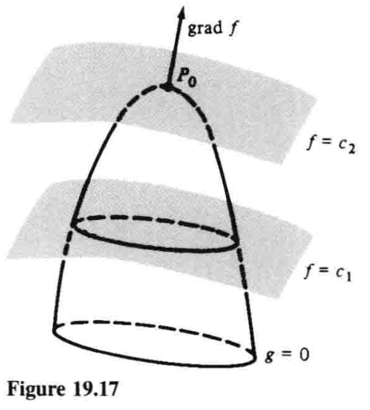
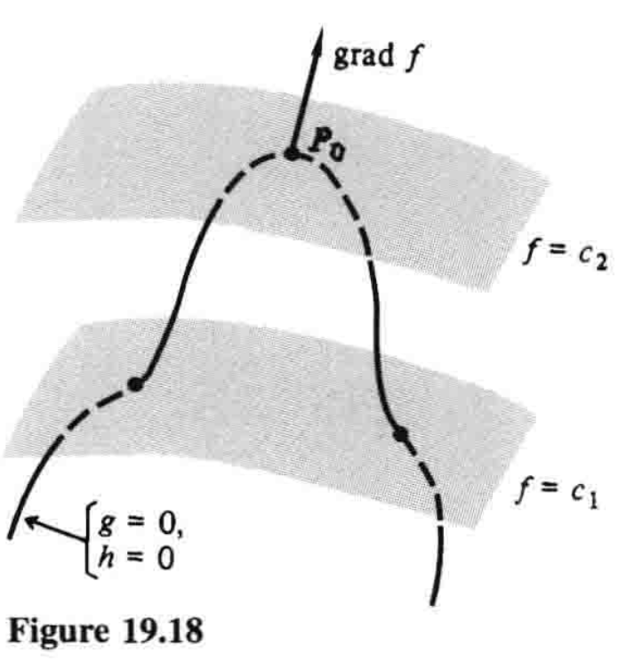

# 19.8 条件极值 Lagrange乘数法

$$
\newcommand{\p}{\partial}
\newcommand{\v}{\mathbf}
\DeclareMathOperator{\grad}{grad}
$$

这一节中，我们通过对梯度的几何意义的直观认识，来阐明Lagrange乘数法. 这一方法用于最大化和最小化受一个或多个约束的多变量函数. 在经济学、微分几何及高级理论力学中，它都是一个重要工具. 

我们从最简单的例子开始，即两个变量和一个约束. 

在19.7节中，我们学习了如何计算关于两个自变量$x$和$y$的函数$z=f(x,y)$的最大值和最小值. 然而很多情况下，$x$和$y$并不是自变量，而是通过等式

$$g(x,y)=0 \tag{1}$$

的形式被连接为一个**边界条件**或**约束**. 

在第4章中，我们已经很熟悉这类情况. 下面是一个简单的示例. 

**例1** 求能内接于半径为$a$的半圆中的最大面积矩形的尺寸. 

**解** 从图19.15可知，问题就是最大化函数

$$A=2xy \tag{2}$$

其满足约束

$$x^2+y^2=a^2 \tag{3}$$

在4.3节例3中，我们利用约束$(3)$，将$A$表示成只关于一个变量的函数，从而解决了问题：

$$y=\sqrt{a^2-x^2}, \quad A=2x\sqrt{a^2-x^2}$$

这时我们计算$dA/dx$，令其等于零，解出这个方程，等等. 这个例子将在一些注记和解释后继续. 

---

刚才我们介绍的过程对于这个问题已然足够，但是若作为一般性的方法，它还有两大不足. 首先，这种特定情形下，从方程$(3)$中很容易解出$y$，但是在其他问题中，约束$(1)$可能非常复杂，于是就很难解或不可能解. 另一个不足是，虽然$x$和$y$事实上在问题中扮演同等的角色，但解题时的处理却大相径庭：我们选出一个变量$x$作为自变量，另一个变量$y$作为因变量. 通常更方便也更优雅的做法是，用对称的方法处理这种问题，不要对某个变量施加相对于其他变量的偏好.[^1]

现在我们回到一般性问题中，即最大化满足约束$g(x,y)=0$的函数$f(x,y)$. 为理解问题，我们作出$g(x,y)=0$的图像（图19.16），还有函数$f(x,y)$的一些等高线$f(x,y)=c$，并指出$c$增大的方向. 例如在图中，我们设$c_1 \lt c_2\lt c_3 \lt c_4$. 为了求$f(x,y)$沿着曲线$g(x,y)=0$的最大值，我们求最大的$c$，使得$f(x,y)=c$和$g(x,y)=0$相交. 在这个交点（图中$P_0$），两曲线有相同的切线，因此它们也有相同的垂线. 又因向量

$$\grad f=\frac{\p f}{\p x}\v{i}+\frac{\p f}{\p y}\v{j}$$

和

$$\grad g=\frac{\p g}{\p x}\v{i}+\frac{\p g}{\p y}\v{j}$$

垂直于两直线，故在$P_0$处互相平行. 因此在$P_0$处，其中一个向量是另一个向量的标量倍数，即

$$\grad f=\lambda \grad g \tag{4}$$

对某个数$\lambda$成立. （这个陈述假设$P_0$处$\grad g \neq \v{0}$，因此曲线$g(x,y)=0$实际上在该点有切线.）

向量方程$(4)$连同$g(x,y)=0$，引出三个标量方程

$$\frac{\p f}{\p x}=\lambda \frac{\p g}{\p x}, \quad \frac{\p f}{\p y}=\lambda \frac{\p g}{\p y}, \quad g(x,y)=0 \tag{5}$$

据此，我们拥有了三个可以联立解出$x$、$y$和$\lambda$的方程. 解出的各点$(x,y)$只是$f(x,y)$满足约束$g(x,y)=0$的可能的最大值（或最小值）点. 对应的各$\lambda$值可能会在解$(5)$的过程中显现，不过我们的兴趣通常不在于它们. 最后一步是计算解出的各点$(x,y)$处$f(x,y)$的值，从而辨明最大值和最小值. 

**Lagrange乘数法**简单来说就是得到方程$(5)$的有力手段：定义关于三个变量$x$、$y$和$\lambda$的函数$L(x,y,\lambda)$：

$$L(x,y,\lambda)=f(x,y)-\lambda g(x,y) \tag{6}$$

观察可知方程$(5)$依次等价于方程

$$\frac{\p L}{\p x}=0, \quad \frac{\p L}{\p y}=0, \quad \frac{\p L}{\p \lambda}=0 \tag{7}$$

变量$\lambda$称为**Lagrange乘数[^2]**. 这样一来，为求出满足约束$g(x,y)=0$的函数$f(x,y)$的**约束**最大值或最小值，我们寻求由$(6)$定义的函数$L$的**无约束**（或**自由**）最大值或最小值. 我们强调，这个方法具有两个主要的实用价值，而且在理论工作中也经常有用：武断选择因变量而破坏问题对称性的弊端不复存在，而且通过引入另一个变量$\lambda$，用很小的代价就消去了约束. 

**例1（续）** 为了用这种方法解决内接矩形问题，我们首先把约束$(3)$写成$x^2+y^2-a^2=0$的形式，然后写出方程

$$L=2xy-\lambda (x^2+y^2-a^2)$$

方程$(7)$就是

$$
\begin{align}
\frac{\p L}{\p x} &= 2y-2\lambda x=0 \tag{8} \\
\frac{\p L}{\p y} &= 2x-2\lambda y=0 \tag{9} \\
\frac{\p L}{\p \lambda} &= -(x^2+y^2-a^2)=0 \tag{10}
\end{align}
$$

由方程$(8)$和$(9)$可得$y=\lambda x$和$x=\lambda y$，代入$(10)$得

$$\lambda^2(x^2+y^2)=a^2$$

又由$(10)$知道$x^2+y^2=a^2$，所以$\lambda^2=1$，$\lambda=±1$. $\lambda=-1$一值意味着$y=-x$，因为$x$和$y$都是正数，所以不可能，故$\lambda=1$，$y=x$. 这给出了最大的内接矩形，即长是宽的两倍，因为

$$\text{长}=2x=2y=2(\text{宽})$$

如果我们想要这个最大矩形的确切尺寸，我们将$y=x$代入$x^2+y^2=a^2$，求得$x=y=\frac{1}{2}\sqrt{2}a$，因此$\text{长}=2x=\sqrt{2}a$，$\text{宽}=y=\frac{1}{2}\sqrt{2}a$. 

---

Lagrange乘数法的一大优势，就是它易于扩展至更多变量、更多约束的情形. 例如，为最大化满足约束$g(x,y,z)=0$的$f(x,y,z)$，梯度

$$\grad f=\frac{\p f}{\p x}\v{i}+\frac{\p f}{\p y}\v{j}+\frac{\p f}{\p z}\v{k}$$

必垂直于曲面$g(x,y,z)=0$（图19.17），故$\grad f$必平行于$\grad g$，我们又有

$$\grad f=\lambda \grad g$$

关于四个未知数$x$、$y$、$z$、$\lambda$的四个方程

$$\frac{\p f}{\p x}=\lambda \frac{\p g}{\p x}, \quad \frac{\p f}{\p y}=\lambda \frac{\p g}{\p y}, \quad \frac{\p f}{\p z}=\lambda \frac{\p g}{\p z}, \quad g(x,y,z)=0$$

又等价于更简单的方程

$$\frac{\p L}{\p x}=0, \quad \frac{\p L}{\p y}=0, \quad \frac{\p L}{\p z}=0, \quad \frac{\p L}{\p \lambda}=0$$

其中$L=f(x,y,z)-\lambda g(x,y,z)$. 

!!! warning "难点"

类似地，考虑我们想要最大化或最小化$f(x,y,z)$，其满足**两个**约束$g(x,y,z)=0$和$h(x,y,z)=0$. 每个约束都定义一个曲面，而且这两个曲面一般相交于一条曲线. 像之前一样，若有一个点$P_0$，使此处$f(x,y,z)$在这条曲线上有最大值或最小值，那么该点处$f$的等值面与曲线相切，亦即$\grad f$垂直于曲线（图19.18）. 又向量$\grad g$和$\grad h$确定了曲线在$P_0$处的法平面，因为$\grad f$位于该平面内，故必有标量$\lambda$和$\mu$（这次是**两个**Lagrange乘数），满足性质

$$\grad f=\lambda \grad g+\mu \grad h$$

（以上讨论假设$\grad g \neq \v{0}$且$\grad h \neq \v{0}$，并且这两个向量也不平行.）正如之前那样，很容易注意到，这个向量方程和两个约束方程等价于下面关于五个未知数的五个方程：

$$\frac{\p L}{\p x}=0, \quad \frac{\p L}{\p y}=0, \quad \frac{\p L}{\p z}=0, \quad \frac{\p L}{\p \lambda}=0, \quad \frac{\p L}{\p \mu}=0$$

其中$L=f(x,y,z)-\lambda g(x,y,z)-\mu h(x,y,z)$. 

我们通过两个例子来展示这些方法. 

**例2** 找出曲面$x+2y+3z=6$上最接近原点的点. 

**解** 我们想要最小化满足约束$x+2y+3z-6=0$的距离$\sqrt{x^2+y^2+z^2}$. 如果距离是最小值，那么它的平方也是最小值，所以我们略微简化计算：在相同约束下最小化$x^2+y^2+z^2$. 令

$$L=x^2+y^2+z^2-\lambda (x+2y+3z-6)$$

随后需要解的方程就是

$$
\begin{align}
\frac{\p L}{\p x} &= 2x-\lambda=0 \\
\frac{\p L}{\p y} &= 2y-2\lambda=0 \\
\frac{\p L}{\p z} &= 2z-3\lambda=0 \\
\frac{\p L}{\p \lambda} &= -(x+2y+3z-6)=0
\end{align}
$$

将前三个方程中的$x$、$y$和$z$代入第四个，得

$$\frac{1}{2}\lambda+2\lambda+\frac{9}{2}\lambda=6, \quad \frac{14}{2}\lambda=6, \quad \lambda=\frac{6}{7}$$

现在可得$x=\frac{3}{7}$，$y=\frac{6}{7}$和$z=\frac{9}{7}$，因此所求点即$(\frac{3}{7},\frac{6}{7},\frac{9}{7})$. 

---

**例3** 找出平面$x+y+z=1$和$3x+2y+z=6$的交线上最接近原点的点. 

这次我们想在两个约束$x+y+z-1=0$和$3x+2y+z-6=0$下最小化$x^2+y^2+z^2$. 如果我们写出

$$L=x^2+y^2+z^2-\lambda (x+y+z-1)-\mu (3x+2y+z-6)$$

那么我们的方程就是

$$
\begin{align}
\frac{\p L}{\p x} &= 2x-\lambda-3\mu=0 \\
\frac{\p L}{\p y} &= 2y-\lambda-2\mu=0 \\
\frac{\p L}{\p z} &= 2z-\lambda-\mu=0 \\
\frac{\p L}{\p \lambda} &= -(x+y+z-1)=0 \\
\frac{\p L}{\p \mu} &= -(3x+2y+z-6)=0
\end{align}
$$

由前三个方程得

$$x=\frac{1}{2}(\lambda+3\mu), \quad y=\frac{1}{2}\lambda+2\mu, \quad z=\frac{1}{2}\lambda+\mu$$

将这些式子代入第四和第五个方程并化简，得

$$
\begin{align}
3\lambda+6\mu &= 2 \\
3\lambda+7\mu &= 6
\end{align}
$$

所以$\mu=4$且$\lambda=-\frac{22}{3}$. 由这两个值得$x=\frac{7}{3}$，$y=\frac{1}{3}$，$z=-\frac{5}{3}$，故所求点为$(\frac{7}{3},\frac{1}{3},-\frac{5}{3})$. 

**注记1** 在经济学中，Lagrange乘数用于分析可用资源受固有限制的制造公司的总产量最大化问题. 例如，令

$$P=f(x,y)=Ax^\alpha y^\beta, \quad \alpha + \beta = 1$$

为$x$单位资本和$y$单位劳动力下的产量（以美元计）. 那么这个函数——经济学上称为**Cobb-Douglas生产函数**——就是19.6节例2中所谓的$1$次齐次的. 设每单位资本的价格是$a$美元、劳动力的价格是$b$美元，并设共有$c$美元可用于支付资本和劳动力的总和，于是我们想要在约束$ax+by=c$下最大化产量$P=f(x,y)$. 在习题23中我们要求学生说明，当$x=\alpha c/a$且$y=\beta c/b$时产量最大化.[^3]

**注记2** 本章开头，我们说Lagrange乘数在微分几何和高级理论力学中也有应用. 这些应用过于复杂，不宜在此阐明，不过其细节可以参考本书作者的*Differential Equations*第二版（McGraw-Hill，1991），521—523和529页. 

[^1]: 伟大的物理学家爱因斯坦曾说——可能是在对数学家和他们的方法感到不耐烦时说的——「优雅是裁缝的」，但他错了. 对于数学家和理论物理学家，他们思考中的审美因素就像厨师对味觉和嗅觉的感知一样不可或缺. 

[^2]: Lagrange multiplier，或曰**Lagrange乘子**. ——译注

[^3]: 关于更多细节，感兴趣的学生可以在19.6节注1提到书籍的索引中查找Cobb-Douglas生产函数. 