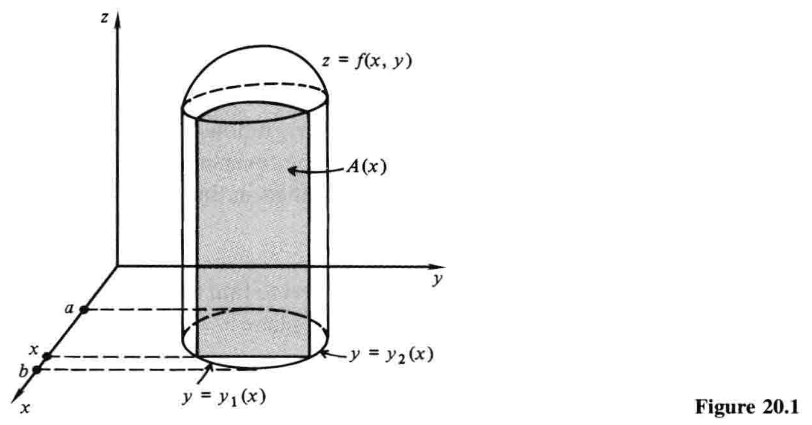
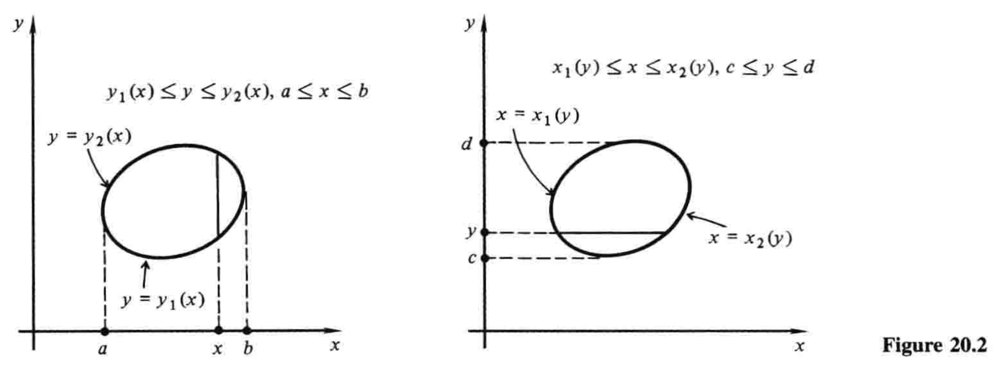
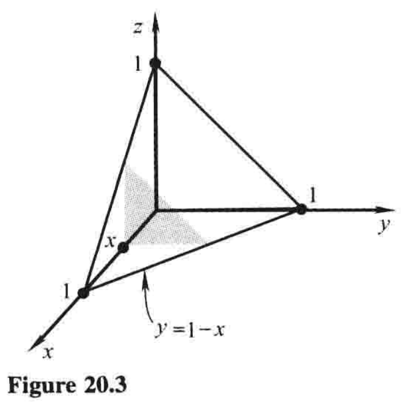
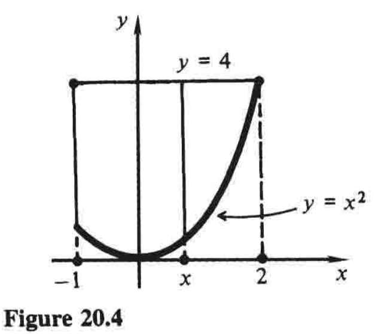
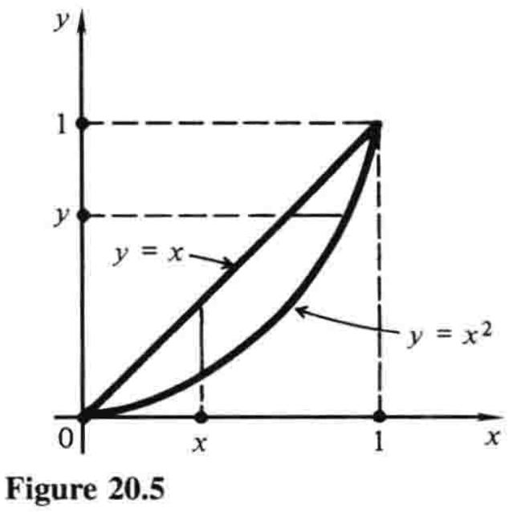

# 20.1 体积作为累次积分[^1]

二元连续函数$f(x,y)$可以在平面区域$R$上被积分，正如一元连续函数可以在区间上被积分. 结果是一个数，称为$f(x,y)$在$R$上的**二重积分**，记作

$$\iint_R f(x,y)dA$$

或

$$\iint_R f(x,y)dxdy$$

一个不同但密切相关的概念是**累次**（或**重复[^2]**）**积分**. 我们将在本节中讨论累次积分，并在下一节回到二重积分的主题，解释它们是什么以及它们与累次积分的关系. 

在7.3节，我们讨论了求体积的「薄片移动法」. 如果用垂直于$x$轴且与原点距离为$x$的平面来切割几何体，截面的面积为$A(x)$，那么式子

$$V=\int_a^b A(x) dx$$

给出了平面$x=a$和$x=b$之间几何体的体积. 这个式子本质上基于这样的看法：

$$dV=A(x) dx$$

是几何体中厚度为$dx$的一个小薄片的体积. 于是，随着薄片扫过整个几何体，换言之，$x$从$a$增长到$b$，总体积$(1)$就可以通过加总（或积分）这些体积元素来求出. 

然而，如果截面本身的边界是弯曲的——很多情况下都会发生——那么确定$A(x)$则同样需要积分. 例如，图20.1所示的截面从$xy$平面$z=0$向上延伸到曲面$z=f(x,y)$. 考虑$x$是任意的，不过姑且固定在$a$和$b$之间，我们注意到，这个截面的面积是

$$A(x)=\int_{y_1(x)}^{y_2(x)} f(x,y) dy \tag{2}$$

其中$y=y_1(x)$和$y=y_2(x)$是约束左右边界的曲线方程. 为求出总体积$V$，我们现在把$(2)$放入$(1)$，得到**累次积分**

$$V=\int_a^b \left[\int_{y_1(x)}^{y_2(x)}f(x,y)dy\right]dx \tag{3}$$

学生应当特别注意，在$(3)$中，我们首先对$f(x,y)$关于$y$积分，保持$x$不变. 积分限取决于这个固定但任意的$x$值，因此，内层积分的结果值也取决于$x$值. 这个内层积分正是$(2)$给出的函数$A(x)$，然后我们从$a$到$b$对$x$进行积分，以获得累次积分$(3)$. 总结一下：我们从一个恒正的二元函数$f(x,y)$开始；首先「积出$y$」，得到只含$x$的函数[^3]；随后「积出$x$」，得到一个数——几何体的体积. 

另一方面，有些情况下，用垂直于$y$轴的平面切割几何体，用别的顺序构造累次积分，可能更为方便. 先积分$x$再积分$y$，

$$V=\int_c^d \left[\int_{x_1(y)}^{x_2(y)}f(x,y)dx\right]dy \tag{4}$$

这两种可能的积分顺序如图20.2所示，其展示了几何体的底面，其中左边是$(3)$，右边是$(4)$. 累次积分$(3)$和$(4)$通常写成不带括号的形式，如

$$\int_a^b \int_{y_1(x)}^{y_2(x)} f(x,y) dy dx , \quad \int_c^d \int_{x_1(y)}^{x_2(y)}f(x,y) dx dy$$

当然，为了更加清晰，只要我们愿意，我们也始终可以保留括号. 积分进行的顺序（先对$y$再对$x$，或者相反）取决于累次积分中$dx$和$dy$书写的顺序：**我们永远都是先内后外**. 

**例1** 利用累次积分，求由坐标平面以及平面$x+y+z=1$围成的四面体的体积. 

**解** 平面$x=常数$内的截面就是图20.3所示的三角形，其底边由$y=0$延伸至$y=1-x$. 其面积为

$$\int_0^{1-x} z dy=\int_0^{1-x} (1-x-y) dy$$

现在我们将其从$x=0$到$x=1$积分，从而求所需的体积：

$$
\begin{align}
V=\int_0^1 \int_0^{1-x} (1-x-y) dy dx &= \int_0^1 \left[y-xy-\frac{1}{2}y^2\right]_0^{1-x}dx \\
&= \int_0^1 \left(\frac{1}{2}-x+\frac{1}{2}x^2\right)dx = \frac{1}{6}
\end{align}
$$

这个结果的正确性可以利用初等几何来验证，事实上，任何四面体的体积都是三分之一的底面积乘以高. 

---

**例2** 求累次积分

$$\int_{-1}^2 \int_{x^2}^4 f(x,y) dy dx$$

在$xy$平面内的积分区域. 

**解** 内层积分中，当$x$固定在$-1$和$2$之间，$y$在曲线$y=x^2$到直线$y=4$之间变化（如图20.4）. 第二次积分中，$x$从$-1$增长到$2$. 积分区域如图所示，被曲线$y=x^2$和直线$y=4$、$x=-1$所围. 学生应特别注意我们是怎样通过分析积分限来判断积分区域的. 

---

**例3** 累次积分

$$\int_0^1 \int_{x^2}^x 2y dy dx \tag{5}$$

在$xy$平面的一个特定区域上进行. 写出一个等价的积分，其积分顺序相反；并计算两个积分. 

**解** 我们注意到所给积分在图20.5所示区域内进行，位于曲线$y=x^2$和$y=x$之间，其中$0 \le x \le 1$. 当积分顺序反转，$y$首先在$y=0$和$y=1$中保持固定，而$x$从$x=y$增长到$x=y^{1/2}$. 因此所求积分为

$$\int_0^1 \int_y^{y^{1/2}} 2y dx dy = \int_0^1 [2xy]_y^{y^{1/2}} dy = \int_0^1(2y^{3/2} - 2y^2) dy = \frac{2}{15}$$

所给积分$(5)$也有相同值，

$$\int_0^1 \int_{x^2}^{x} 2y dy dx = \int_0^1 [y^2]_{x^2}^x dx = \int_0^1(x^2-x^4)dx = \frac{2}{15}$$

因为两个累次积分都给出特定几何体的体积，这个体积无论怎样算出，必然相同. 在这类计算问题中，我们当然可以自由使用任何所需的来自我们过往经验的积分方法——三角换元法、分部积分法等等. 

[^1]: Iterated Integrals，又译**迭代积分**. ——译注

[^2]: repeated——译注

[^3]: 注意到，$\int_a^b f(x,y) dy$的结果通常是关于$x$的函数. ——译注