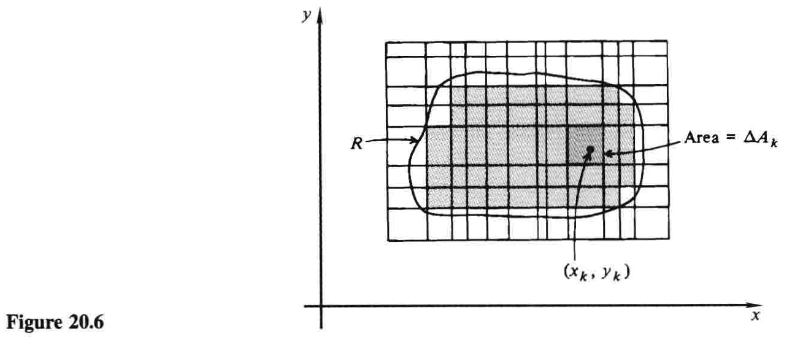
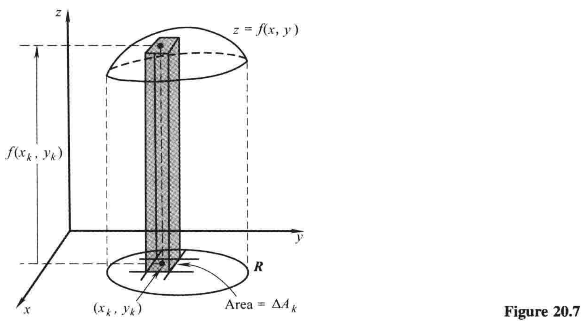
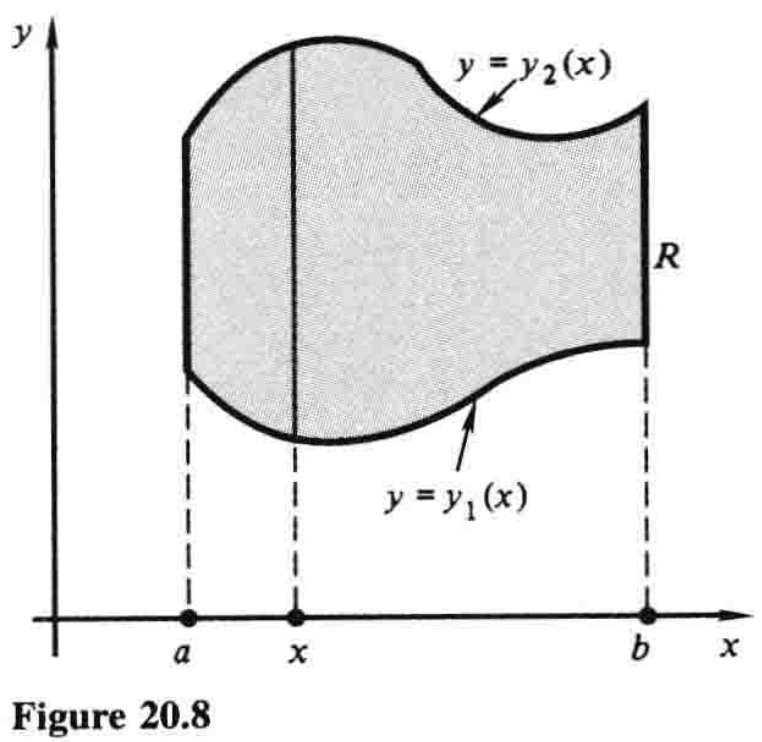
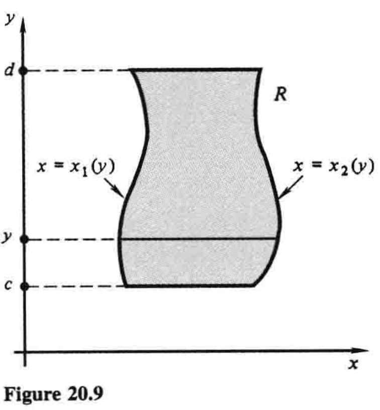
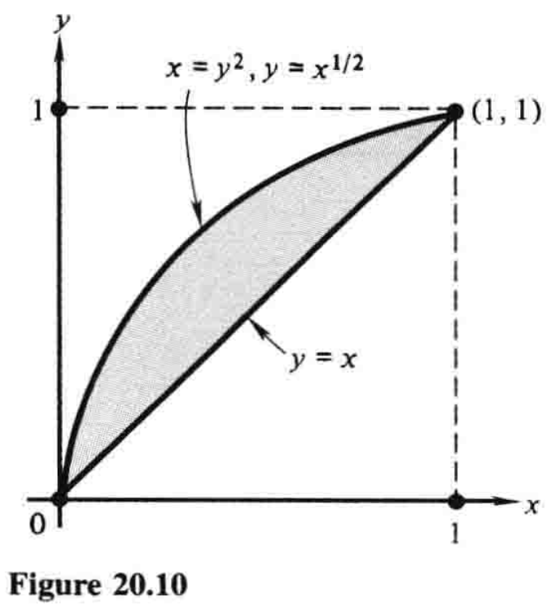
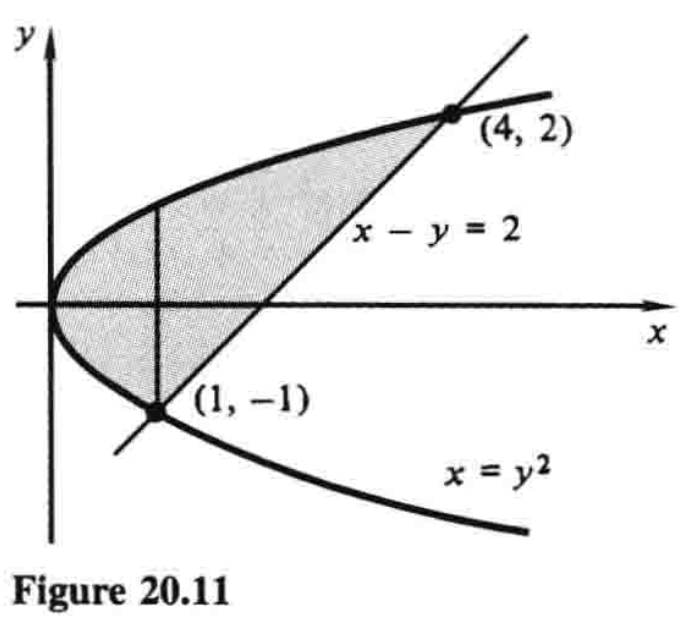
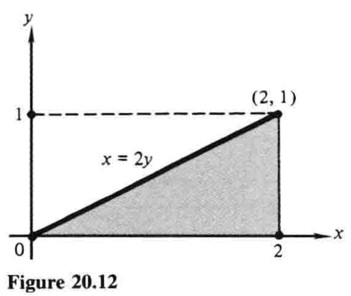

# 20.2 二重积分和累次积分

二元函数的二重积分，是一元函数定积分在二维中的对应概念. 方便起见，这里把一元函数积分称为**单积分**，与概念**二重积分**相对. 

我们知道，单积分$\int_a^b f(x) dx$的值取决于函数$f(x)$和区间$[a,b]$. 在二重积分的情形中，区间$[a,b]$被替代为$xy$平面中的区域$R$. $f(x,y)$在$R$上的二重积分记作

$$\iint_R f(x,y) dA \tag{1}$$

后文将会解释记号$dA$的含义. 

我们回忆一下，在6.4节中，单积分被定义为特定求和的极限. 我们现在用基本相同的方式定义二重积分$(1)$. 

设想一个定义在$xy$平面内一区域$R$上的连续函数$f(x,y)$. 有必要假定$R$是**有界的**，这样一来，它就可以被一个充分大的矩形所包含，并且在任何方向上都不会趋于无穷；否则，正如单积分中$a$或$b$趋于无穷的情形那样，二重积分将会是**反常的**. 

我们着手用平行于坐标轴的网格线覆盖$R$，如图20.6所示，其中相邻平行线之间的距离可以相等，也可以不等. 这些直线把平面分成许多小矩形. 有些矩形可能部分或全部逸出$R$外，这些我们忽略. 其他的矩形则整个位于$R$内，如果它们总共有$n$个——我们假设至少有一个——那么我们用任意顺序给它们标号为$1$到$n$，并记第$k$个矩形的面积为$\Delta A_k$. 现在我们在第$k$个矩形中选择任意一点$(x_k,y_k)$，写出求和式

$$\sum_{k=1}^n f(x_k,y_k) \Delta A_k \tag{2}$$

最后，想象越来越多的平行线被加进来形成网格，把已有的矩形分成更小的矩形，并考虑与这个分区更精细的平面相对应的求和$(2)$. 如果当$n$趋于无穷且矩形的最大对角线（即所有矩形中最长的对角线）趋于零——无关于分割线和矩形内点$(x_k,y_k)$的选法——求和趋于一个特定的极限，那么二重积分$(1)$就定义为以下极限：

$$\iint_R f(x,y) dA = \lim \sum_{k=1}^n f(x_k,y_k) \Delta A_k \tag{3}$$

目前看来，定义$(3)$与相应的单积分定义相比区别不大. 然而在二维中，存在某些不会出现在一维中的技术困难. 至少平面区域比区间$[a,b]$复杂多了. 不过，在足够通用的假设下，可以严格证明二重积分的存在. 具体而言，假设我们所考虑的区域包含其边界，而且这些边界由有限个光滑曲线构成，则已然足够. 

我们不应该想着把二重积分搞得特别理论化. 这是个难题，最好留待高级微积分课程去研究.[^1] 相反，我们希望强调二重积分的直观意义，并集中关注其几何和物理应用. 

作为该观点的一个示范，设$z=f(x,y)$是$xyz$空间中一曲面的方程，其位于区域$R$的上面，因此在$R$上$f(x,y) \gt 0$，如图20.7. 那么$f(x_k,y_k)\Delta A_k$大致就是图中小柱体的体积（高乘以底面积）；和式$(2)$就是许多这种体积的和，因此也大致是曲面下立体的总体积；而极限$(3)$，即二重积分

$$\iint_R f(x,y) dA \tag{1}$$

则给出了立体的精确体积.[^2]

显然，若$f(x,y)$为常数，即$f(x,y)=c$，那么

$$\iint_R f(x,y) dA = cA$$

其中$A$是区域$R$的面积. 特别地，若$f(x,y)=1$，则有

$$\iint_R dA=A$$

我们也指出，在定义$(3)$中，并没有要求$f(x,y)$必须为正. 如果$f(x,y)$既可为正也可为负，那么二重积分表示一个**代数体积[^3]**，而不是几何体积；即$z=f(x,y)$和$xy$平面之间的体积当$f(x,y) \gt 0$时为正，当$f(x,y) \lt 0$时为负. 

由于各边平行于坐标轴的矩形的面积可被写成$\Delta A=\Delta x \Delta y$，使用

$$\iint_R f(x,y) dx dy \tag{4}$$

作为二重积分$(1)$的替代记号，则是合理的. 这种形式下，二重积分类似于一个累次积分，而且事实上，我们稍后会解释，当区域$R$满足某种简单的形状时，二重积分$(1)$总等于一个选择恰当的累次积分. 这种等价性经常误导学生认为二重积分大致跟累次积分相同，实则不然. 我们下面细说这两种积分的区别. 

一个区域$R$称为**竖直简单的**，当它能被描述为不等式

$$a \le x \le b, \quad y_1(x) \le y \le y_2(x) \tag{5}$$

的形式，其中$y=y_1(x)$和$y=y_2(x)$是$[a,b]$上的连续函数. 这种区域如图20.8所示. 类似地，一个区域$R$称为**水平简单的**，当它能被描述为不等式

$$c \le y \le d, \quad x_1(y) \le x \le x_2(y) \tag{6}$$

的形式，其中$x=x_1(y)$和$x=x_2(y)$是$[c,d]$上的连续函数. 图20.9中的区域具有这种性质. 

下面是关于使用累次积分来计算二重积分的基本事实：**若$R$为$(5)$给出的竖直简单区域，那么**

$$\iint_R f(x,y) dA = \int_a^b \int_{y_1(x)}^{y_2(x)} f(x,y) dy dx \tag{7}$$

**又若$R$为$(6)$给出的水平简单区域，那么**

$$\iint_R f(x,y) dA = \int_c^d \int_{x_1(y)}^{x_2(y)} f(x,y) dx dy \tag{8}$$

除了其在计算二重积分方面显而易见的实践价值以外，这些等式还服务于澄清二重积分和累次积分之间的概念差异. 二重积分是与函数$f(x,y)$和区域$R$相关联的一个数，而这个数的存在和意义独立于任何特定的计算方法. 另一方面，一个累次积分就是**自带一套计算流程**的二重积分. 因此，每个累次积分都是二重积分，反之则不然. 

**例1** 用两种不同的方法计算二重积分$\iint_R 2xy dA$，其中$R$是由抛物线$x=y^2$和直线$y=x$围成的区域。

**解** **每次解二重积分前，画出积分区域$R$是很有必要的。**此题中，区域如图20.10所示。显然$R$是竖直简单的，其中$a=0$，$b=1$，$y_1(x)=x$，$y_2(x)=x^{1/2}$，因此由$(7)$得

$$
\begin{align}
\iint_R 2xy\,dA &= \int_0^1 \int_x^{x^{1/2}} 2xy\,dy\,dx = \int_0^1 [xy^2]_x^{x^{1/2}}\,dx \\
&= \int_0^1 (x^2-x^3) \, dx = \frac{1}{3} - \frac{1}{4} = \frac{1}{12}
\end{align}
$$

区域$R$同样也是水平简单的，其中$c=0$，$d=1$，$x_1(y)=y^2$，$x_2(y)=y$，因此由$(8)$得

$$
\begin{align}
\iint_R 2xy \, dA &= \int_0^1 \int_{y^2}^{y} 2xy\,dx\,dy = \int_0^1 [x^2y]_{y^2}^y \, dy \\
&= \int_0^1 (y^3-y^5) \, dy = \frac{1}{4}-\frac{1}{6}=\frac{1}{12}
\end{align}
$$

---

**例2** 求$\iint_R (1+2x)\, dA$，其中$R$是由$x=y^2$和$x-y=2$围成的区域。

**解** 此区域如图20.11。若要先对$y$积分，再对$x$积分，我们需要计算两个不同的积分，一个位于直线$x=1$左边，一个在右边，因为对$y$积分的积分限在这两块区域是不同的：

$$\iint_R (1+2x)\,dA = \int_0^1\int_{-\sqrt{x}}^{\sqrt{x}} (1+2x)\,dy\,dx + \int_1^4\int_{x-2}^{\sqrt{x}} (1+2x)\,dy\,dx$$

另一种顺序则更简单，可得

$$
\begin{align}
\iint_R (1+2x)\,dA &= \int_{-1}^{2}\int_{y^2}^{y+2} (1+2x)\,dx\,dy = \int_{-1}^{2} [x+x^2]_{y^2}^{y+2}\,dy \\
&= \int_{-1}^{2} (6+5y-y^4)\,dy = \frac{189}{10}
\end{align}
$$

---

例2说明，即便区域$R$既竖直简单又水平简单，用一个顺序积分也可能比另一个顺序更容易，我们自然是希望做得越容易越好。有时积分顺序的选择取决于被积函数$f(x,y)$的特性，因为或许用某种顺序计算积分很难甚至不可能，但是**如果顺序反过来**就好做多了。

**例3** 求

$$\int_0^1 \int_{2y}^2 4e^{x^2}\,dx\,dy$$

**解** 我们不能用这种顺序积分，因为$\int e^{x^2}\,dx$并非初等函数。因此我们尝试别的顺序。这需要我们根据给定累次积分的积分限画出区域$R$。$R$如图20.12，在另一种顺序下，上述二重积分的值为

$$
\begin{align}
\iint_R 4e^{x^2}\,dA &= \int_0^2 \int_0^{x/2} 4e^{x^2}\,dy\,dx = \int_0^2 \left[4ye^{x^2}\right]_0^{x/2}\,dx \\
&= \int_0^2 2xe^{x^2}\,dx = [e^{x^2}]_0^2 = e^4-1
\end{align}
$$

[^1]: 即便到了这个层次，也需要学习传统的那种高级微积分. 例如，见Philip Franklin的*A Treatise on Advanced Calculus*（Wiley，1940）；或Angus E. Taylor的*Advanced Calculus*（Ginn，1955）. 

[^2]: 二重积分$(1)$实则是三维空间中一个**区域**的体积，不过说成一个**立体**的体积貌似更自然. 

[^3]: Algebraic volume，或曰**带符号体积**. ——译注