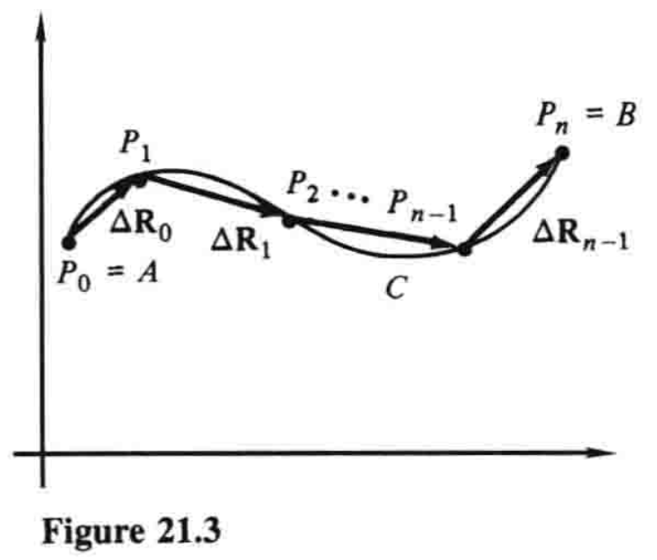

# 21.1 平面上的曲线积分

$\newcommand{\v}{\mathbf} \DeclareMathOperator{\grad}{grad} \newcommand{\p}{\partial}$

本章将多变量微积分中的几个主题熔于一炉，这些主题对物理科学、工程以及数学本身都至关重要. 我们研究的主要焦点是曲线积分和曲面积分的概念，它们提供了将普通积分扩展到更高维度的其他方法（除二重和三重积分外）. 例如，曲线积分用于计算变力沿着弯曲路径将质点从一个点移动到另一个点时所做的功. 从起源到应用来看，这些积分在数学物理中的地位正如其在数学中的地位. 本章第一部分的主要结果（格林定理）运用偏导数在曲线积分和二重积分之间建立联系，这反过来又使我们能够区分那些具有或不具有势能函数的向量场. 在这里，正如我们此前所见，数学和物理学结合得天衣无缝，互相不可或缺. 

本章通篇我们都假设：凡讨论到的函数均具备给定情形中必需的所有连续及可微性质. 

我们的第一个问题是，构建一个理想的功的概念. 如果我们以恒力$\v{F}$（方向和大小都恒定）将质点沿着直线推动，那么我们知道，该力所做的功就是$\v{F}$在运动方向上的分力与质点运动距离的乘积. 方便起见，使用点积将其写成

$$W=\v{F} \cdot \Delta \v{R} \tag{1}$$

其中$\Delta \v{R}$是从质点的起点到终点的向量. 现在设想力$\v{F}$并非恒定，而是一个向量函数，随平面某区域内点的位置而变化，即

$$\v{F}=\v{F}(x,y) = M(x,y)\v{i} + N(x,y)\v{j} \tag{2}$$

接着设想这个变力沿着平面内一光滑曲线$C$，推动一个质点，其中$C$有参数方程

$$x=x(t), \quad y=y(t), \quad t_1 \le t \le t_2 \tag{3}$$

那么随着作用点沿着曲线从起点$A$到终点$B$移动，这个力所做的功是多少？

回答这个问题之前，我们先提一下，向量值函数$(2)$通常称为**力场**. 更一般地说，平面内的一个**向量场**，就是把一个向量与某一平面区域内的每个点$(x,y)$关联起来的向量值函数. 此种语境下，一个值为数（标量）的函数就称为**标量场**. 例如，函数$f(x,y)=x^2y^3$就是一个标量场，定义在整个$xy$平面上. 每个标量场$f(x,y)$都有对应的向量场

$$\nabla f(x,y)=\grad f=\frac{\p f}{\p x}\v{i}+\frac{\p f}{\p y}\v{j}$$

（要记得符号$\nabla f$读作「del $f$」. ）这称为$f$的**梯度场**；它的直观意义在19.5节中说过了. 对于刚才提到的函数，我们有$\nabla f=2xy^3\v{i} + 3x^2y^2\v{j}$. 一部分向量场是梯度场，但大部分不是. 下一节中我们将看到，那些亦是梯度场的向量场格外重要. 

现在我们回到计算变力

$$\v{F}=M(x,y)\v{i}+N(x,y)\v{j} \tag{2}$$

沿着光滑曲线$C$做功的问题上来. 这引进一种新的积分，名曰曲线积分，记作

$$\int_C \v{F}\cdot d\v{R}$$

或

$$\int_C M(x,y)\, dx+N(x,y)\, dy$$

现在开始定义. 用如图21.3所示的折线路径来拟合曲线，也就是，依次沿着$C$选取点$P_0=A, P_1, P_2, \dots, P_{n-1}, P_n=B$，令$\v{R}_k$为$P_k$的位置向量，定义如图所示的$n$个增量向量$\Delta \v{R}_k=\v{R}_{k+1}-\v{R}_k$，其中$k=0,1,\dots,n-1$. 如果我们现在记$\v{F}_k$为向量函数$\v{F}$在$P_k$处的值，并求和

$$\sum_{k=0}^{n-1} \v{F}_k \cdot \Delta \v{R}_k \tag{4}$$

那么**$\v{F}$沿着$C$的曲线积分**就定义为该求和的极限，记作

$$\int_C \v{F}\cdot d\v{R}=\lim \sum_{k=0}^{n-1} \v{F}_k \cdot \Delta \v{R}_k \tag{5}$$

这个极限中，折线路径理解为越来越精确地拟合曲线，此时分点的数量越来越多，并且增量向量的最大长度趋于零.
