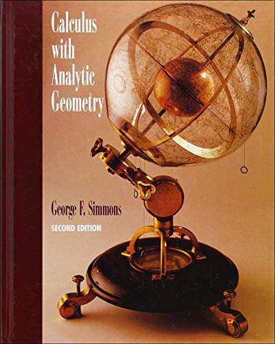

# 微积分与解析几何（在线中文版）

欢迎阅读《微积分与解析几何（在线中文版）》！本书是 George F. Simmons 所著的 ***Calculus With Analytic Geometry (Second Edition)*** 的非官方中文版，由笔者在个人学习过程中翻译。

从法律上来说，笔者并未取得作者本人与出版社官方的授权，自然亦无翻译权。私自翻译并在网上传播，属法律灰色地带，严格来说属侵权行为。对此首先向原作者致歉。究其原因，笔者在自己的学习过程中，接触到了许多国外的优秀著作。这些著作叙述流畅、见解独到、高屋建瓴，对于笔者这类数学天赋一般的读者而言，实为不可多得的珍贵资料。然而，这类著作常常没有中文版，若想拜读，难免要过外语关。虽然在学术界，英语是默认熟练掌握的通用语言，但是对于本科乃至于本科以下的多数初学者而言，从头到尾阅读大部头英语著作，的确令人望而生畏，也容易消磨对数学的热情，反而不利于数学的学习。笔者一开始阅读这些著作，同样磕磕绊绊，深知其艰难性。因此，本着帮助各位学习者的愿望，也不枉自己逐页攻读所付出的努力，笔者决定在学习之余，将这部著作自译成中文，弥补缺少中文版的遗憾，打破学习的语言障碍。由于笔者无任何利益方面的考量，此种行为在法律层面也有碍观瞻，希望各位读者切勿将此翻译版用于任何商业用途。同时也希望有条件者支持正版，尊重广大数学工作者的劳动成果。只有我们共同营造一个良好的数学学习和研究氛围，整个环境才能够良性发展，广大爱好者也能够看到更多优秀的精品资料。

翻译过程中，笔者尽量保证忠实于原文，同时兼顾语言的流畅性。众所周知，英文的部分语法句式与中文相比有显著差异，对于数学这类讲究语言严谨性的学科而言，如果过分忠于原文，将使得译文诘屈聱牙、逻辑晦涩。因此，笔者尽量在原文和译文通达之间作一些取舍，将重心放在核心思想的传递，而不拘泥于特定的句式、语序。

同时，笔者也根据自己的理解，加了一些注释。这类注释在末尾都标记为「译注」。笔者的理解当然不如原作者深刻，因此仅供参考。如有不当之处，欢迎提issue指正！

目前，翻译工作主要在笔者闲暇时间进行，无法承诺持续更新。或许将来，这个项目也会像笔者一些别的项目一样，开一个巨大的坑，然后弃坑。坦诚地说，我感觉我这个坑已经开得有点大了（逃）